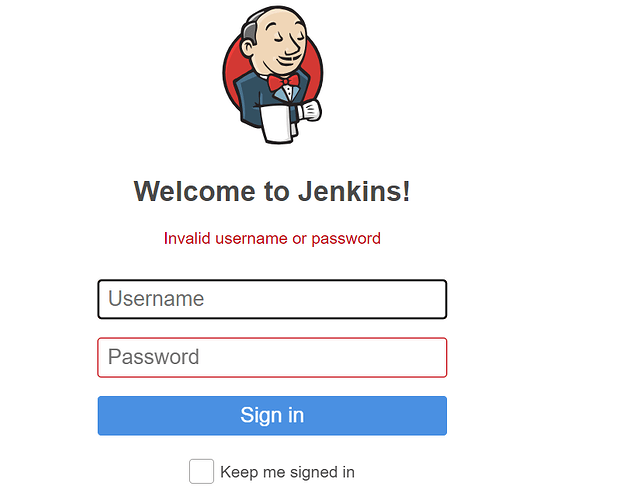

# Product Assessment

**For Alpha Corp**

June 2024

Version 1.0

Prepared by John Doe

PentestPros\newline
Website: https://pentest.pros\newline
Email: hello@pentest.pros\newline

\pagebreak

## Table of Contents

- [Executive Summary](#executive-summary)
- [Immediate Next Steps](#immediate-next-steps)
- [Strategic Recommendations](#strategic-recommendations)
- [Document Control](#document-control)
- [Assessment Overview](#assessment-overview)
- [Assessment Findings](#assessment-findings)
- [Appendix](#appendix)

\pagebreak

## Executive Summary

Lorem ipsum dolor sit amet, consectetur adipiscing elit. Ut sed mollis dui. Maecenas gravida odio vitae erat ullamcorper, eu mollis enim viverra. Cras ac ipsum ut lacus viverra lobortis. Maecenas scelerisque dui et ullamcorper rhoncus. Ut scelerisque, eros eget cursus feugiat, justo nunc tempus lorem, eget mattis mi purus sit amet nisi. Etiam sodales neque a massa vestibulum suscipit. Morbi elementum sapien vitae sollicitudin auctor. Interdum et malesuada fames ac ante ipsum primis in faucibus. Mauris velit tellus, convallis non dignissim quis, tincidunt et nulla. Nullam non bibendum libero.

Duis iaculis facilisis leo, sed viverra tellus. Sed est libero, interdum mollis lectus ac, porta hendrerit ipsum. Donec bibendum ante sed leo luctus, nec cursus neque dignissim. Phasellus luctus viverra convallis. Integer bibendum dignissim lectus sed tempor. Nulla dictum elit quis risus aliquet ultricies. Fusce eget turpis sed lorem aliquet pharetra. Mauris vitae odio venenatis, convallis magna eu, iaculis dolor. Donec turpis lorem, facilisis non dapibus non, porta ac dui. Nullam accumsan consectetur dui. Nulla facilisi. Vestibulum sed bibendum diam. Cras non eros eu nunc scelerisque pharetra.

Mauris eu volutpat tortor, at mollis lectus. Nam in orci hendrerit, rhoncus ex vitae, pellentesque tortor. Integer ullamcorper ipsum ut nulla elementum tincidunt. Phasellus nec mauris a lectus tincidunt faucibus. Nulla facilisi. In a facilisis diam. In volutpat purus vitae nibh euismod, in commodo enim malesuada. Ut ultricies lorem faucibus elit scelerisque, id mattis erat condimentum. Duis lacinia tempus purus, et molestie elit pharetra eget. Phasellus at euismod nulla. Aenean sodales odio condimentum, pulvinar mauris eu, posuere ligula. In ut justo ligula. Ut nec commodo lacus, a sodales ipsum. Integer sit amet nisl vel ipsum dapibus hendrerit non eget erat. Morbi nunc justo, tincidunt non aliquam vitae, finibus eu lectus.

Nulla dapibus ac orci eu euismod. Proin vitae sollicitudin dui, vitae tempus ipsum. Mauris porttitor eros sed lacinia molestie. Proin ut dapibus ante. Vivamus est tellus, ultrices sit amet feugiat non, ultrices vitae lacus. Vestibulum dui ligula, maximus at iaculis et, fringilla eget nisi. Fusce sed purus elementum, dapibus quam iaculis, tincidunt leo. Sed ornare placerat sodales. Cras viverra enim libero, tristique vehicula nunc egestas at.

Cras aliquam ligula nisi, vel mollis massa pulvinar non. Fusce purus nisl, malesuada et ullamcorper vel, sagittis nec massa. Nam vehicula neque in nisl condimentum mollis. Cras rhoncus ornare eros, nec sagittis tellus fringilla pharetra. Praesent vehicula aliquam lectus, ac blandit turpis placerat ac. Ut ac tincidunt felis, dignissim sodales augue. Vivamus vehicula, est sit amet efficitur scelerisque, nisl lacus facilisis sem, a condimentum erat leo eu justo. Quisque venenatis nec augue at consectetur. Cras eu eleifend odio, at ullamcorper erat. Aliquam placerat neque sed efficitur facilisis. Nunc imperdiet cursus mauris vitae maximus.

\pagebreak

## Immediate Next Steps

The following immediate next steps are recommended to address the critical security findings identified during the assessment:

- Lorem ipsum dolor sit amet, consectetur adipiscing elit.
- Nunc et ante at quam maximus aliquet id eu ante.
- Pellentesque condimentum eros placerat odio lacinia, et sagittis mi bibendum.
- Aenean a metus quis massa elementum malesuada.

\pagebreak

## Strategic Recommendations

Phasellus blandit urna nec ante convallis tempor. Nulla maximus metus velit. Cras mauris felis, lacinia et risus ac, maximus bibendum dolor. Suspendisse ullamcorper elit molestie magna finibus volutpat. Quisque et nunc convallis, convallis orci vel, consectetur libero. Proin eget facilisis tellus, euismod blandit augue. Duis vitae neque eu ante pellentesque aliquam ac eu turpis. Proin iaculis, orci in imperdiet ultrices, tellus magna sollicitudin massa, a auctor neque justo at risus. Praesent ut condimentum lectus, non gravida turpis.

Sed at molestie erat, sed blandit tellus. Vestibulum ut gravida ex, id mattis tellus. Proin sit amet sodales lacus. Proin euismod id eros in rutrum. Maecenas in dolor vel nibh volutpat mattis a sit amet risus. Fusce id purus id purus condimentum euismod. Proin vitae viverra sapien. Ut elementum, neque at tincidunt feugiat, eros sem fermentum justo, non efficitur lacus diam a ipsum.

Duis venenatis vehicula leo vitae efficitur. Etiam risus nisi, mollis eget ultrices sed, dignissim vehicula mi. Morbi convallis risus nec purus consectetur pretium id at lorem. In ullamcorper mi id elementum aliquet. Etiam porttitor mi orci, vel venenatis arcu porttitor nec. Quisque metus diam, dignissim id vestibulum in, volutpat id nisi. Suspendisse placerat mauris sapien, quis viverra erat tempor sit amet. Sed et libero id mi luctus vulputate. Nunc a molestie ligula.

Morbi a iaculis enim, et dignissim lorem. Donec fermentum neque non mi condimentum, at tincidunt risus mattis. Morbi nec iaculis enim. Vivamus fringilla id metus sed rhoncus. Mauris turpis risus, tincidunt vitae ullamcorper vitae, porttitor nec sapien. Duis eleifend, ipsum imperdiet condimentum accumsan, ipsum tellus consequat est, et suscipit turpis urna vitae nulla. Nunc mattis aliquam erat feugiat dignissim. Nulla facilisi. Praesent et ipsum imperdiet, iaculis urna quis, eleifend metus. Sed feugiat, neque eget pharetra lobortis, nisi erat pellentesque mi, sit amet finibus ex augue ut justo. Suspendisse venenatis at diam tempus euismod. Nam quis tortor eget velit finibus vehicula. Aenean at luctus ipsum, nec auctor enim.

Integer in neque pretium, vulputate augue id, dignissim diam. Duis ornare malesuada purus id tempor. Duis vestibulum, eros ut suscipit ornare, enim nisi interdum libero, vitae sodales est massa eget nunc. Quisque ac sapien molestie, pulvinar magna vel, malesuada justo. Duis ultrices metus eget risus bibendum, et pharetra massa viverra. Nam sapien mauris, ultrices sed lacus eget, dignissim ullamcorper leo. Duis eu leo sollicitudin, iaculis magna ac, molestie velit. Praesent eu est purus. Curabitur hendrerit in massa id venenatis. Phasellus lobortis sapien id justo efficitur, a condimentum ipsum consequat. Ut vel nibh nec mi efficitur fringilla quis ut arcu. Nullam at ullamcorper lacus. Aenean vitae tellus purus. Nulla quis mauris porttitor, bibendum ipsum in, egestas odio. Integer cursus id neque vel egestas.

\pagebreak

## Document Control

### Assessment Metadata

|   |   |   |   |
|---|---|---|---|
| **Assessment Title**   | Product Assessment |
| **Report ID**          | AC-001-01          |
| **Proposal Reference** | AC-01              |
| **Client Representative** | Bob Anders       |
| **Engagement Manager** | John Doe           |
| **Date**               | June 2024          |
| **Classification**     | Client Confidential|

### Version History

| **Version** | **Date**     | **Author** | **Change Summary**        |
|-------------|--------------|------------|---------------------------|
| 0.1         | 2024-06-01   | John Doe   | Initial Draft             |
| 0.2         | 2024-06-02   | Jane Doe   | Initial Review            |
| 1.0         | 2024-06-04   | John Doe   | Released to client        |

\pagebreak

## Assessment Overview

### Scope

Sed at molestie erat, sed blandit tellus. Vestibulum ut gravida ex, id mattis tellus. Proin sit amet sodales lacus. Proin euismod id eros in rutrum. Maecenas in dolor vel nibh volutpat mattis a sit amet risus. Fusce id purus id purus condimentum euismod. Proin vitae viverra sapien. Ut elementum, neque at tincidunt feugiat, eros sem fermentum justo, non efficitur lacus diam a ipsum.

### Caveats

Suspendisse placerat mauris sapien, quis viverra erat tempor sit amet. Sed et libero id mi luctus vulputate. Nunc a molestie ligula.

### Findings Overview

| **Risk Rating** | **Findings** |
|-----------------|--------------|
| High            | 1            |

\pagebreak

### List of Findings

#### External Infrastructure

- **High - Jenkins Server Exposed to the Internet**
- ...

\pagebreak

## Assessment Findings

### Phase 1: External Infrastructure

**Jenkins Server Exposed to the Internet**

Morbi a iaculis enim, et dignissim lorem. Donec fermentum neque non mi condimentum, at tincidunt risus mattis. Morbi nec iaculis enim. Vivamus fringilla id metus sed rhoncus. Mauris turpis risus, tincidunt vitae ullamcorper vitae, porttitor nec sapien. Duis eleifend, ipsum imperdiet condimentum accumsan, ipsum tellus consequat est, et suscipit turpis urna vitae nulla. Nunc mattis aliquam erat feugiat dignissim. Nulla facilisi. Praesent et ipsum imperdiet, iaculis urna quis, eleifend metus. Sed feugiat, neque eget pharetra lobortis, nisi erat pellentesque mi, sit amet finibus ex augue ut justo. Suspendisse venenatis at diam tempus euismod. Nam quis tortor eget velit finibus vehicula. Aenean at luctus ipsum, nec auctor enim.

Integer in neque pretium, vulputate augue id, dignissim diam. 

**Recommendation**

Sed at molestie erat, sed blandit tellus. Vestibulum ut gravida ex, id mattis tellus. Proin sit amet sodales lacus. Proin euismod id eros in rutrum. Maecenas in dolor vel nibh volutpat mattis a sit amet risus. Fusce id purus id purus condimentum euismod. Proin vitae viverra sapien. Ut elementum, neque at tincidunt feugiat, eros sem fermentum justo, non efficitur lacus diam a ipsum.

Duis venenatis vehicula leo vitae efficitur. Etiam risus nisi, mollis eget ultrices sed, dignissim vehicula mi. Morbi convallis risus nec purus consectetur pretium id at lorem. In ullamcorper mi id elementum aliquet. Etiam porttitor mi orci, vel venenatis arcu porttitor nec. Quisque metus diam, dignissim id vestibulum in, volutpat id nisi. Suspendisse placerat mauris sapien, quis viverra erat tempor sit amet. Sed et libero id mi luctus vulputate. Nunc a molestie ligula.

**Location**

- Lorem ipsum...
- Lorem ipsum...
- Lorem ipsum...

\pagebreak

## Appendix

### Assessment Team

| **Name**    | **Role**     | **Job Title**         | **Notes** |
|-------------|--------------|-----------------------|-----------|
| John Doe    | Team Lead    | Security Consultant   | OSCP      |
| Jane Doe    | Team Member  | Security Consultant   | CISSP     |

\pagebreak

### Risk Rating Definitions

| **Risk Rating** | **Definition** |
|-----------------|----------------|
| Critical        | Lorem ipsum... |
| High            | Lorem ipsum... |
| Medium          | Lorem ipsum... |
| Low             | Lorem ipsum... |
| Informational   | Lorem ipsum... |

